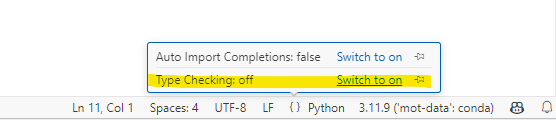
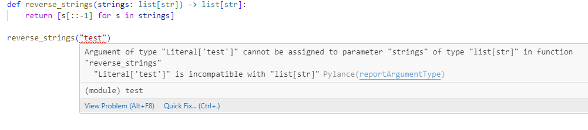

# Type hints are useful but not strictly enforced

You can tell Python what types you expect to be passed to a function using type hints - these aren't strictly enforced, unlike in C/C++/etc., but are just useful for telling you/others what types to expect.

It's also useful because you can use type-checking tools to _strictly_ enforce/test that you've passed the right types.

e.g. if you have a function

```python
def reverse_strings(strings):
    return [s[::-1] for s in strings]
```

You will see:

```python
>>> reverse_strings(["hello", "richard"])
["olleh", "drahcir"]
```

Which might be what you expect, but you'll also see:

```python
>>> reverse_strings(("hello", "richard"))
["olleh", "drahcir"]

>>> reverse_strings("hello richard")
['h', 'e', 'l', 'l', 'o', ' ', 'r', 'i', 'c', 'h', 'a', 'r', 'd']
```

Which might not be - in the first case we've passed a tuple, but it has returned a list; and in the second case we've passed a single string and it's returned a list of strings.

You can make what the function expects/returns explicit by using type hints:

```python
def reverse_strings(strings: list[str]) -> list[str]:
    return [s[::-1] for s in strings]
```

There're also special types in the `typing` module for `Iterable`s, `Union`s etc. if you want to be more general with your types and accept any iterable/multiple types etc.

## Default arguments

If you want a default argument you can do:

```python
def f(x: int, name : str = ""):
    ...
```

## Type-checking tools

There are command-line tools like `mypy`, `Pyright` and `Pyre`.

If you are using VS Code then the Pylance extension (which I think gets installed automatically if you install the Python extension?) has a type checking mode built in. You can turn this on from the status bar:



Incorrect types get underlined in red:



Via: [Richard](https://github.com/richard-lane) and [James](https://github.com/jatonline)
